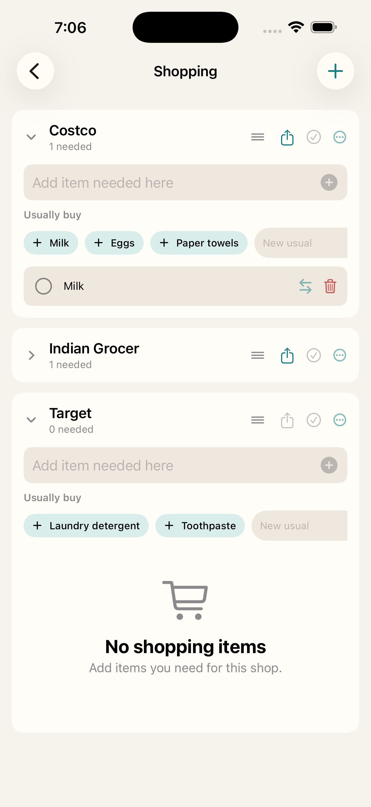
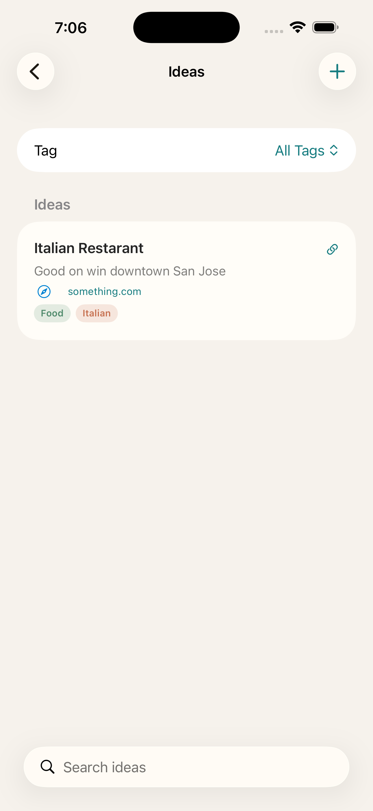
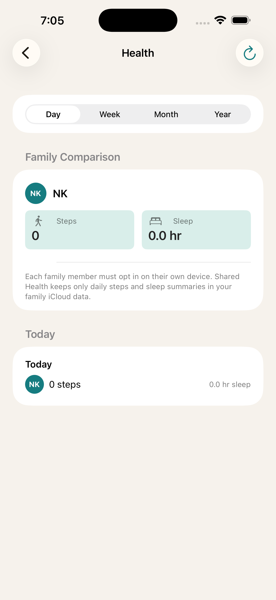
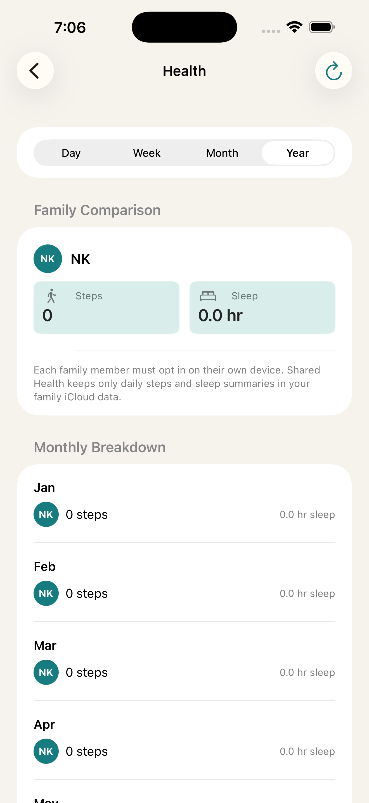

# Family Task Planner

[](https://apps.apple.com/us/app/family-task-planner/id6771995830)

Family Task Planner is a SwiftUI iOS app for running a household together. It combines task planning, calendar-aware today views, shared shopping lists, recurring responsibilities, meal planning, ideas, and optional family health summaries in one family workspace.

## Screenshots

| Menu | Task Matrix | Shopping |
| --- | --- | --- |
|  |  |  |

| Ideas | Health Day | Health Year |
| --- | --- | --- |
|  |  |  |

## Features

- Today view for scheduled tasks and imported calendar events.
- Eisenhower-style task matrix with Do, Schedule, Delegate, and Drop sections.
- Family member assignment using initials/profile avatars.
- Calendar integration with EventKit, including Google calendars configured on the device.
- Shopping lists grouped by shop, with shareable bullet-point lists.
- Recurring tasks for bills, household services, and repeated chores.
- Meal planning with reusable meal ideas, week/day planning, breakfast/lunch/dinner slots, and ingredient-to-grocery handoff.
- Ideas notebook for saving links, places, activities, and family finds by tag.
- Optional Health section for opted-in family steps and sleep summaries.
- Profile/settings area for identity, family members, notifications, calendar integration, view preferences, and Health settings.
- App icon, privacy manifest, and App Store release checklist included.

## Project Structure

```text
FamilyTasks/
  Models/       Data models for tasks, shopping, meals, ideas, health summaries, and recurring items
  Stores/       Local persistence and app state
  Services/     Calendar, notifications, HealthKit, and CloudKit sharing services
  Views/        SwiftUI screens and reusable views
```

## Calendar Sync

The app uses EventKit. If a Google account is added under iOS Settings > Calendar > Accounts, tasks and Today calendar events can use writable Google calendars when available.

## Family Sharing

The app uses CloudKit sharing for a shared household workspace. Tasks, family member emails, profiles, shopping lists, recurring tasks, meal ideas, planned meals, ideas, and opted-in health summaries are stored as one shared household payload after the owner shares it from iCloud Settings.

Health sharing is opt-in per device. The app stores only small daily steps and sleep summaries in the family iCloud payload; raw HealthKit data stays on each family member's device.

CloudKit family sharing should be tested on physical devices with two separate iCloud accounts before App Store submission.

See [`docs/cloudkit-sharing-test-plan.md`](docs/cloudkit-sharing-test-plan.md) for the Debug and TestFlight sharing checklist.

## App Store Notes

See [`FamilyTasks/AppStoreReleaseChecklist.md`](FamilyTasks/AppStoreReleaseChecklist.md) and [`FamilyTasks/AppStoreMetadataDraft.md`](FamilyTasks/AppStoreMetadataDraft.md).

Apple currently requires App Store uploads after April 28, 2026 to be built with the iOS/iPadOS 26 SDK or later, so final archive/upload should be done from Xcode 26+.
