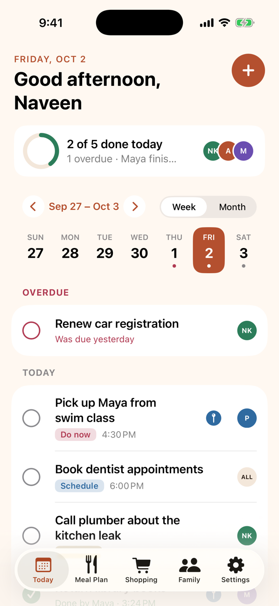
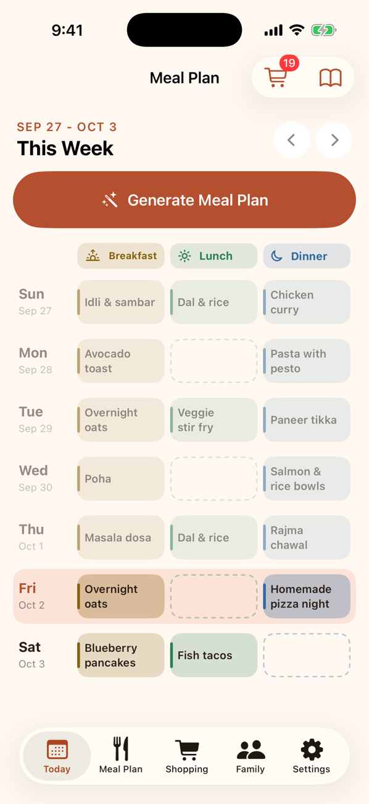
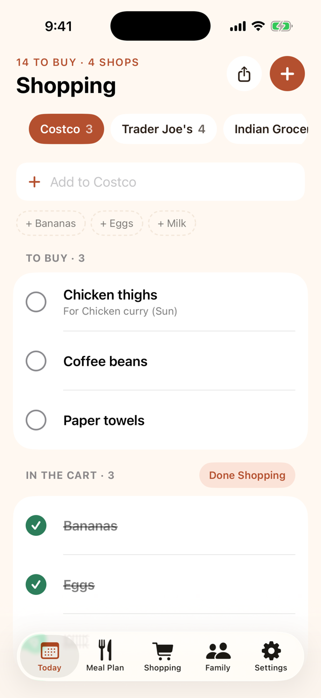
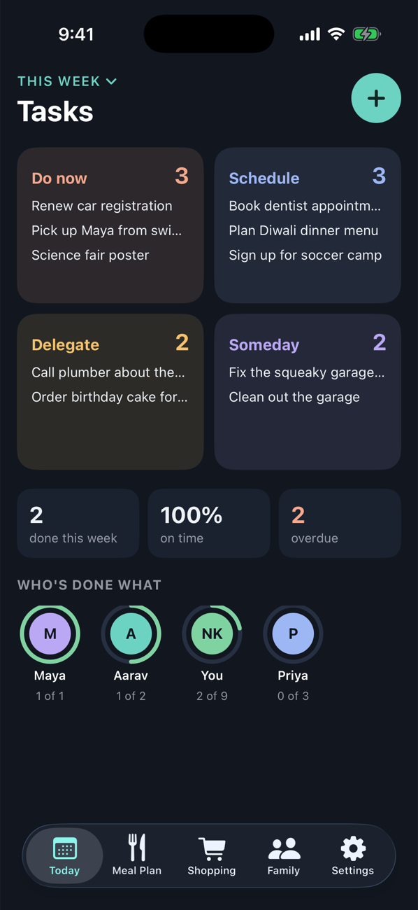
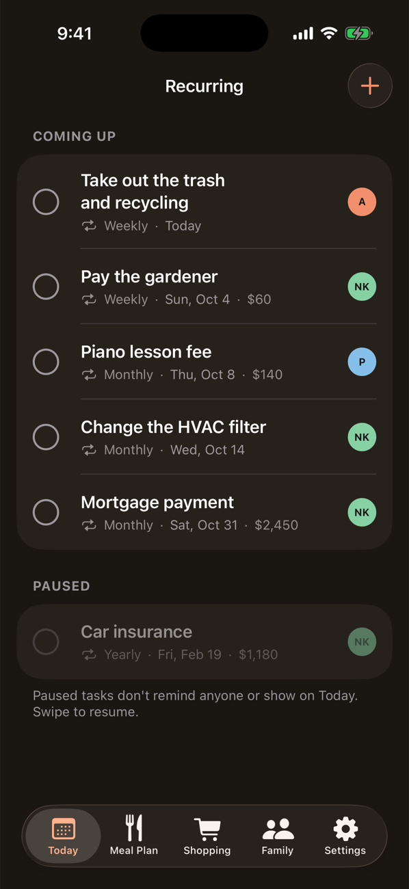
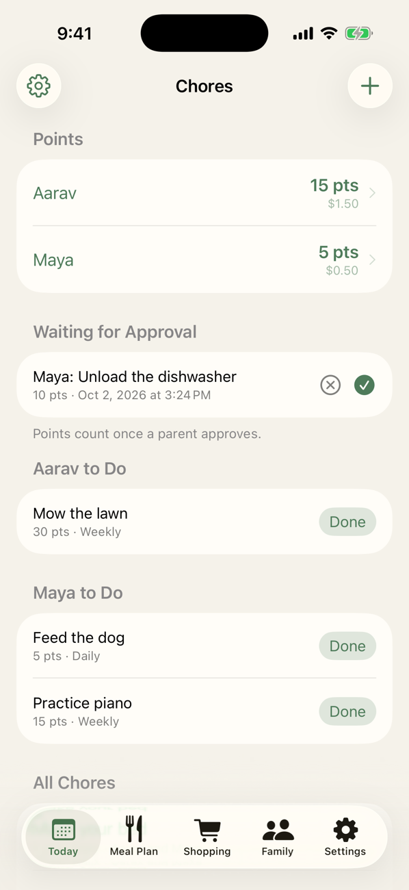
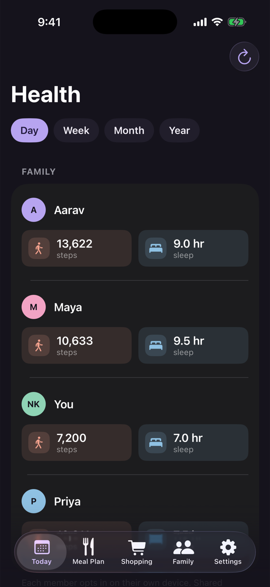
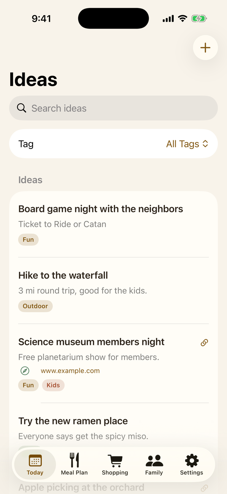
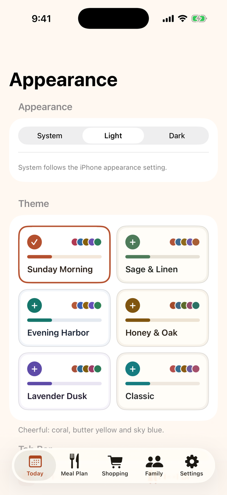

# Family Task Planner

[](https://apps.apple.com/us/app/family-task-planner/id6771995830)

Family Task Planner is a SwiftUI iOS app for running a household together. It combines task planning, calendar-aware today views, shared shopping lists, recurring responsibilities, meal planning, ideas, and optional family health summaries in one family workspace.

## Screenshots

<table>
  <tr>
    <td align="center"><br><sub>Today</sub></td>
    <td align="center"><br><sub>Meal Plan</sub></td>
    <td align="center"><br><sub>Shopping</sub></td>
  </tr>
  <tr>
    <td align="center"><br><sub>Tasks</sub></td>
    <td align="center"><br><sub>Recurring</sub></td>
    <td align="center"><br><sub>Chores</sub></td>
  </tr>
  <tr>
    <td align="center"><br><sub>Health</sub></td>
    <td align="center"><br><sub>Ideas</sub></td>
    <td align="center"><br><sub>Themes</sub></td>
  </tr>
</table>

## Features

- **Today:** a greeting header with today's progress, a Week or Month view, tasks with initials avatars and priority tags, calendar events, and recurring items.
- **Tasks:** a big-title editor with a people picker, quick due dates, reminders, a location with a map pin (opens Apple Maps, Google Maps or Waze), and Do now / Schedule / Delegate / Someday priorities. A task matrix groups them by priority.
- **"Done by" news:** a notification when a family member finishes a task.
- **Meal Plan:** a weekly grid with color-coded breakfast, lunch and dinner columns.
  - **Generate Meal Plan** fills the empty slots from saved meals. You can review it, swap a meal, choose your own, or stop suggesting one.
  - Each meal can repeat up to a set number of times a week.
  - **Shop for This Week** turns the week's ingredients into shopping items at each one's shop.
- **Shopping:** lists grouped by shop, a notification when someone finishes shopping, and lists you can share.
- **Chores:** chores for kids with points, parent approval, conversion to money in your currency, and a running total.
- **Recurring tasks:** bills, services and chores that come round again, with pause and resume.
- **Ideas:** saved links, places and activities, with colored tags.
- **Health (optional):** family steps and sleep summaries, opted in on each device.
- **Personalize:** six color themes (Sunday Morning by default), light or dark mode, and your choice of the two middle tabs.
- **Widgets and Siri:** Today and Shopping widgets, plus Shortcuts actions.
- **Family sharing:** through iCloud (CloudKit), with each item synced as its own record.

## Project Structure

```text
FamilyTasks/
  Models/       Data models for tasks, shopping, meals, ideas, health summaries, and recurring items
  Stores/       Local persistence and app state
  Services/     Calendar, notifications, HealthKit, and CloudKit sharing services
  Views/        SwiftUI screens and reusable views
```

## Calendar Sync

The app uses EventKit. If a Google account is added under iOS Settings > Calendar > Accounts, tasks and Today calendar events can use writable Google calendars when available.

## Family Sharing

The app uses CloudKit sharing for a shared household workspace. After the owner shares it from iCloud Sharing settings, tasks, family members, shopping lists, recurring tasks, meals, planned meals, chores, ideas, and opted-in health summaries sync as individual records in the shared zone, with push notifications for changes.

Health sharing is opt-in per device. The app stores only small daily steps and sleep summaries in the family iCloud payload; raw HealthKit data stays on each family member's device.

CloudKit family sharing should be tested on physical devices with two separate iCloud accounts before App Store submission.

See [`docs/cloudkit-sharing-test-plan.md`](docs/cloudkit-sharing-test-plan.md) for the Debug and TestFlight sharing checklist.

## App Store Notes

See [`FamilyTasks/AppStoreReleaseChecklist.md`](FamilyTasks/AppStoreReleaseChecklist.md) and [`FamilyTasks/AppStoreMetadataDraft.md`](FamilyTasks/AppStoreMetadataDraft.md).

Apple currently requires App Store uploads after April 28, 2026 to be built with the iOS/iPadOS 26 SDK or later, so final archive/upload should be done from Xcode 26+.
